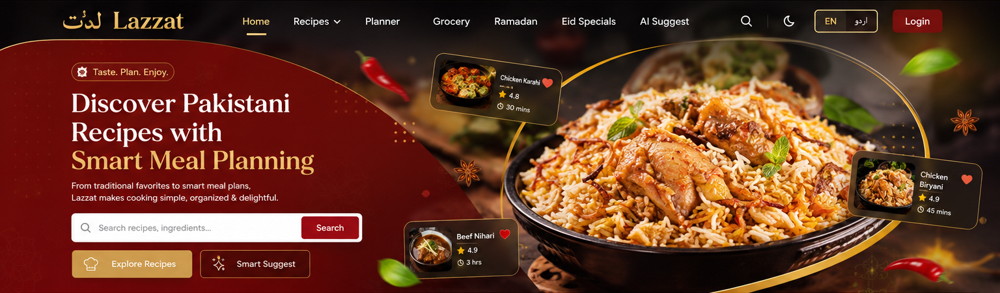
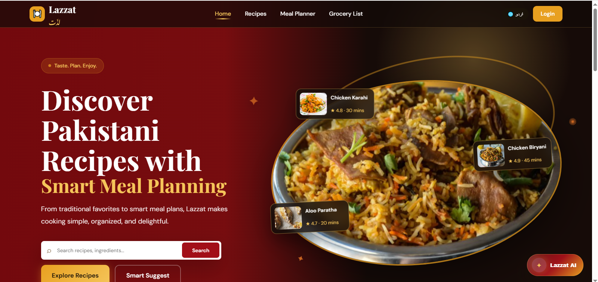
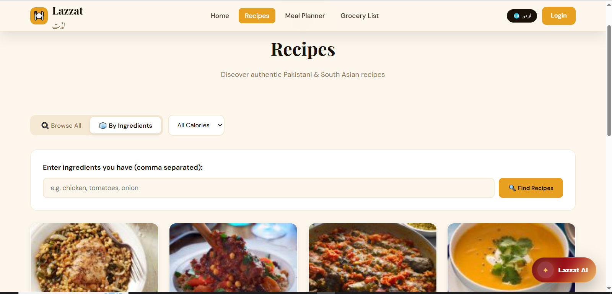
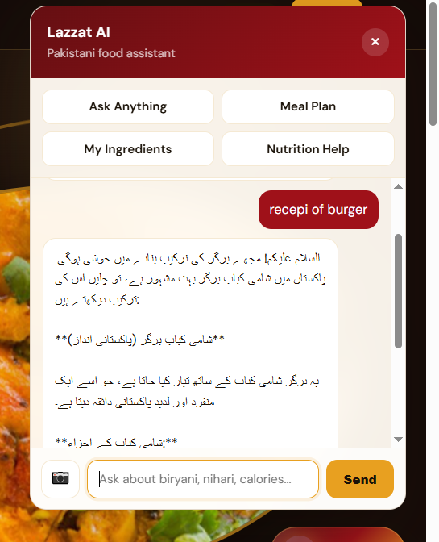

<p align="center">
  
</p>

<h1 align="center">Lazzat (لذّت)</h1>
<p align="center">Pakistani Recipe Discovery & Meal Planning Web Application</p>

<p align="center">
  
  
  
  
</p>

---

## About Lazzat

Lazzat (لذّت) — Urdu for *taste* — is a full-stack web application built for Pakistani users to discover traditional recipes, plan weekly meals, manage grocery lists, and get AI-powered cooking assistance. It supports full **English and Urdu (RTL)** bilingual operation.

---

## Features

- 🍽️ **Recipe Discovery** — 150+ Pakistani recipes from TheMealDB & Spoonacular APIs
- 📅 **Weekly Meal Planner** — 7-day interactive planner with breakfast, lunch & dinner slots
- 🛒 **Smart Grocery List** — Auto-generated from meal plan with PDF export
- 🤖 **Lazzat AI** — 4-in-1 assistant (recipes, meal plans, ingredients, nutrition) powered by Gemini
- 🔐 **Secure Auth** — Laravel session-based login & registration with bcrypt
- 🌐 **Bilingual** — Full English & Urdu with right-to-left text support

---

## Screenshots

| Home Page | Recipes Page |
|-----------|-------------|
|  |  |

| recipes-ingredient | grocerylist |
|-----------|-------------|
|  |  |
| grocery-print |Ai |
|-----------|-------------|
|  |  |

---
## Video 

| Home Page |

https://github.com/user-attachments/assets/cfd60bca-bddf-4501-975a-67e154d34aa4

|Dashboard|

 | 
 
https://github.com/user-attachments/assets/82b12aac-fc31-42ac-be8f-f0ba61e9e152

|Meal-Planner|

 | ![Meal-Planner-Englis-Urdu]
 https://github.com/user-attachments/assets/64ae9b18-7dec-495c-9342-526164fc64d6

## Tech Stack

| Layer | Technology |
|-------|-----------|
| Backend | Laravel 11, PHP 8.2 |
| Database | SQLite 3 |
| Frontend | Blade Templates, Vanilla JavaScript, Custom CSS |
| Recipe APIs | TheMealDB API, Spoonacular API |
| AI API | Gemni API (Llama 3.3-70B) |
| Auth | Laravel Session Auth, bcrypt |

---

## Installation

```bash
git clone https://github.com/Muniba-ishfaq33/lazzat.git
cd lazzat
composer install
cp .env.example .env
php artisan key:generate
php artisan migrate
php artisan serve
```

Add these to your `.env` file:
```env
Gemini Api Key_API_KEY=your_api_key_here
Gemini_MODEL=gemini-2.5-flash
SPOONACULAR_KEY=your_spoonacular_key_here
```

Open `http://localhost:8000` in your browser.

---

## Project Info

**Course:**  Web Technologies  
**University:** COMSATS University Islamabad, Vehari Campus  
**Student:** Muniba Ishfaq — SP24-BSSE-024/VHR  
**Instructor:** Yasmeen Jana  
**Semester:** Spring 2026
